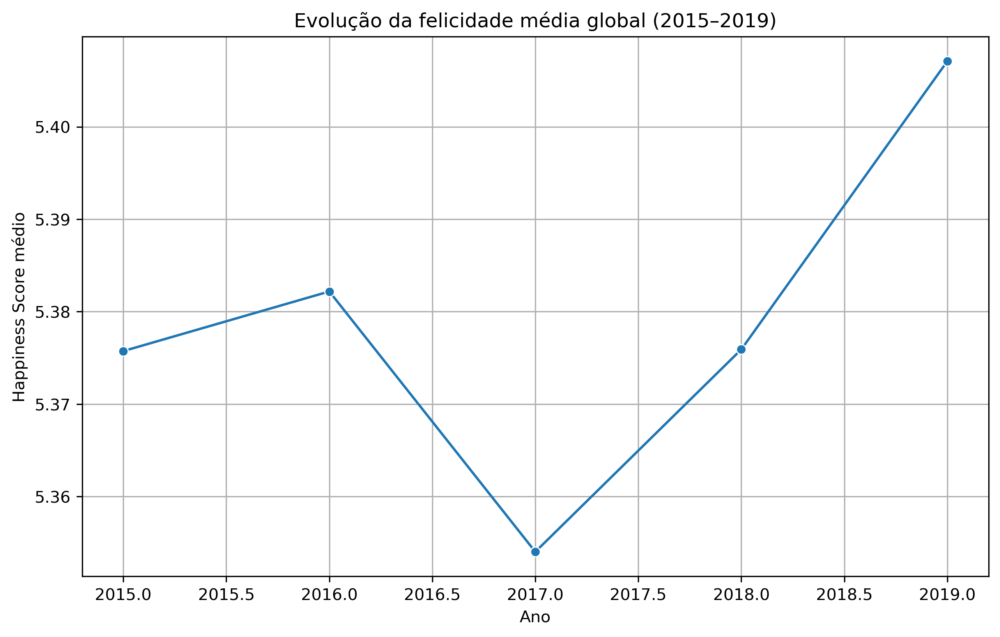

# 🌍 World Happiness Analysis (2015–2019)

Este projeto realiza uma **análise exploratória dos dados do World Happiness Report** entre os anos de 2015 e 2019, com o objetivo de entender:

- Quais países são os mais e menos felizes ao longo dos anos  
- Como a felicidade média global evoluiu no período  
- Quais fatores socioeconômicos mais influenciam o nível de felicidade  

---

## 📊 Dataset

Os dados utilizados são provenientes do **World Happiness Report**, contendo informações como:

- Happiness Score  
- GDP per Capita  
- Social Support (Family)  
- Life Expectancy  
- Freedom to make life choices  
- Generosity  
- Perceptions of corruption  

Cada ano possui pequenas variações nos nomes das colunas, que foram tratadas e padronizadas ao longo da análise.

---

## 🔍 Análises realizadas

### 1️⃣ Top 10 países mais e menos felizes por ano
Identificação dos países com maiores e menores níveis de felicidade em cada ano analisado.

### 2️⃣ Evolução da felicidade média global
Análise da média global do Happiness Score entre 2015 e 2019.

### 3️⃣ Distribuição do Happiness Score
Histogramas para entender a distribuição da felicidade em cada ano.

### 4️⃣ Relação entre fatores socioeconômicos e felicidade
Gráficos de dispersão analisando a relação entre felicidade e:
- GDP per Capita  
- Social Support  
- Life Expectancy  
- Freedom  
- Generosity  

### 5️⃣ Correlação entre os fatores
Heatmaps de correlação mostrando quais fatores possuem maior associação com o Happiness Score ao longo dos anos.

---

## 📈 Principais insights

- **PIB per capita, apoio social e expectativa de vida** apresentam as correlações mais fortes com a felicidade.
- O **apoio social (Family)** se destaca como um dos fatores mais consistentes.
- A estrutura socioeconômica dos países tem impacto direto no nível de felicidade.
- O padrão dos resultados se mantém relativamente estável entre 2015 e 2019.

---

## 🛠️ Tecnologias utilizadas

- Python  
- Pandas  
- Matplotlib  
- Seaborn  

---

## 🚀 Próximos passos

- Análise por regiões
- Comparação entre países desenvolvidos e em desenvolvimento
- Modelagem preditiva do Happiness Score

---

📌 *Projeto desenvolvido para fins educacionais e de portfólio em Análise de Dados.*
